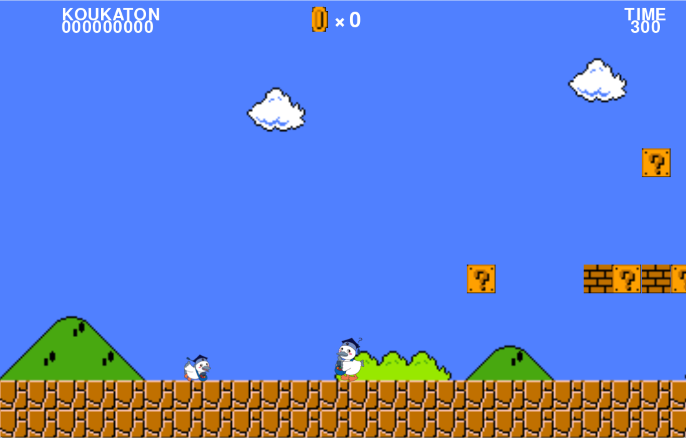

# スーパーこうかとんブラザーズ

## 実行環境の必要条件
* python >= 3.10
* pygame >= 2.1

## ゲームの概要
* 主人公のこうかとんがさらわれた敵をよけながらゴールを目指すゲーム
## ゲームの遊び方
* 十字キーでキャラを操作する
* スペースキーでジャンプ
* 左シフトでダッシュ
* 敵を上から踏むと倒せる
* 敵、コイン、ゴールでスコアが上がる
* 制限時間以内にゴールしないとゲームオーバー
* キノコを取ると巨大化
## ゲームの実装
### 共通基本機能
* 背景画像と主人公キャラクターの描画
* 背景がキャラとともに動く
* 十字キーでキャラを動かす
* 地形を作る
* ゴールでゲーム終了
* 地形に乗ることができる
* ジャンプできる

### 分担追加機能 
* 敵を踏んで倒せる (り)
* 敵がランダムに空から出現 (加藤)
* 敵がプレイヤーに向かって来る (加藤)
* 敵に当たるとゲームオーバー (加藤)
* 左シフトを押すとダッシュ (河辺)
* ブロックを叩ける(体が大きければ壊せる) (束田)
* アイテムの出現 (束田)
* ゴールでゲーム終了 (束田)
* スコア表示 (束田)
* 食べると体が大きくなるアイテム (波部)

### ToDo
- キャラクターの変数名の統一
- 敵キャラの変数名決め
- 登場キャラの決定
- アイテム決定

### メモ
* 敵のクラス名はEnemy
* アイテムのクラス名はMushroom
* def grow() 関数を作り、Itemに触れると大きくなるようにする。

